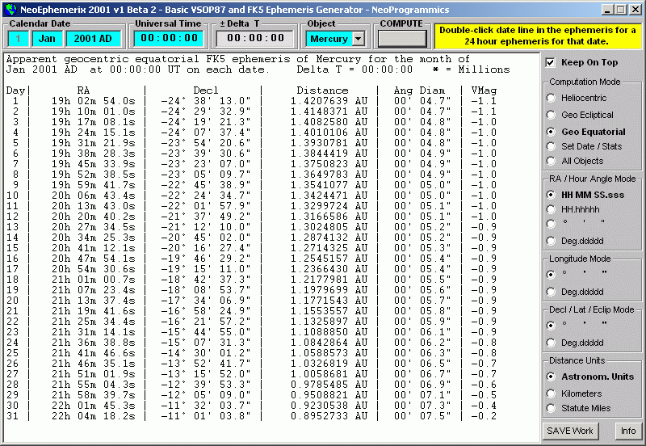



## NeoEphemerix\_2001

### Description

  NeoEphemerix 2001 - v1 Beta 2  

Written using VB 6 

Requires 800x600 display or better  

  

This program is for astronomy hobbyists who want to create their own custom VB astronomical almanac program. It is a very complex program consisting hundreds of thousands of orbital computations and represents about 6 month's work so far.  

The program will generate high-precision ephemerides for the sun and planets from Mercury to Neptune.  

It has reached the beta level of functionality and I encourage any fellow astro-computationists to give it a try and offer any comments, bug reports and suggestions regarding it.  

Anyone who ever wanted to learn how to perform their own high-precision planetary orbit computations, may find the source code helpful, but the math required is rather advanced.  

A new version with even more computations is in the works. Any suggestions from users of this program will be considered in the design of future upgrades.  

NOTE:

Due to the enormous size of the mathematical core modules and the complexity of the computations required to get almanic-like accuracy, the program takes about 30 minutes to compile into an executable on a 200 MHz machine and will produce a finished program about 4.3 megs in size.

The visual magnitude computation of the planet Saturn will be applied to a future version, but magnitudes are computed for the other planets. The allowance for the rings contribution to its brightness hasn't been formulated yet.  

This version of the program does not yet specifically check to see if the date entered is in the proper range for the selected planet, so the following table is provided as a guide.  

 

VSOP87 Heliocentric coordinates are theoretically accurate to an arcsecond or better within the following ranges: 

Mercury to Mars - 2000 BC to 6000 AD 

Jupiter and Saturn - 1 BC to 4000 AD 

Uranus and Neptune - 6000 BC to 8000 AD  

To any users familiar with the astronomical algorithms of Jean Meeus and others, this program applies many of the same concepts, but at a higher level of precision not possible from the limited tables applied in the popular books on astronomical computing.  

It is based on a Visual BASIC implementation of the full VSOP87 theory of planetary orbits in spherical variables.  

Its theoretical heliocentric accuracy is to within ±1 arcsecond or better over the ranges specified for each planet in terms of dynamical time.  

Since the full theory is implemented, the accuracy of the orbit computations compares very favorably with the published almanacs.  

To achieve this level of accuracy, over 30,000 computational terms are applied to the raw, dynamical orbit computations.  

The computations include corrections for precession and the long-term effects of relativity on the orbits. Then corrections are applied for light-time, aberration, reduction to the standard FK5 system of coordinates and nutation.   

FEATURES INCLUDE:  

Both VSOP87 heliocentric and apparent geocentric ecliptical and equatorial coordinates  

Ephemerides tables can be generated by the day, hour or minute  and can be saved to disk as plain text files  

Allowance for delta-T can be applied when known. 

Distances to the planets from the sun or Earth can be displayed in astronomical units, millions of kilometers or miles.  

Hour angles may be displayed in hours minutes and seconds, decimal hours, degrees minutes and seconds of arc or decimal degrees.  

Latitudes may be displayed in degrees minutes and seconds of arc or decimal degrees.  

A table showing the VSOP heliocentric position and geocentric ecliptical and equatorial coordinates for the sun and the eight major planets at any given moment can be displayed  

Basic astronomical data such as the mean and apparent obliquity of the ecliptic, mean and apparent sidereal time at Greenwich and nutation in longitude can also be computed.  

The program also has a stay-on-top feature that can be toggled to lock the window in front of other windows when needed.  

All program settings are preserved when the program terminates and are recalled the next time the program starts up. 

  

This program is still a rough draft but functional enough to be useful.  

I would appreciate any feedback on user of this code who are also into astro-computing, since it would help me to improve on future implementations.

  
 
### More Info
 
Date, time, mode selections

Creates a high-precision almanac of planet positions.

             |
---                |---
**Submitted On**   |2001-01-31 02:58:00
**By**             |[Jay Tanner](https://github.com/Planet-Source-Code/PSCIndex/blob/master/ByAuthor/jay-tanner.md)
**Level**          |Advanced
**User Rating**    |5.0 (130 globes from 26 users)
**Compatibility**  |VB 6\.0
**Category**       |[Math/ Dates](https://github.com/Planet-Source-Code/PSCIndex/blob/master/ByCategory/math-dates__1-37.md)
**World**          |[Visual Basic](https://github.com/Planet-Source-Code/PSCIndex/blob/master/ByWorld/visual-basic.md)
**Archive File**   |[CODE\_UPLOAD148352112001\.zip](https://github.com/Planet-Source-Code/jay-tanner-neoephemerix-2001__1-15223/archive/master.zip)

